# Bamazon-Cli-App
A client based app to behave like a basic online store

## Table of Contents

* Application Overview/Use
* Technologies Used
* Application Details (How it works)
* Screenshots of application

## Application Overview/Use

This is a terminal application that utilizes node.js to run a series of different interfaces for a very simple storefront. There is a customer view, which displays the products for sale, and allows purchases, a manager view allowing the user to review the stock, search for low stock items and to update and add items to the inventory, and a supervisor view to review total sales figures and add new departments to the store. The mySQL database maintains the data for the inventory and pricing and is updated dynamically as tasks are performed in the app. 

## Commands and Instructions

### bamazonCustomer.js

* Initializing the app will display a list of all available products for sale, their id numbers and price. The user is then prompted to confirm if they want to buy something or not. 

* If the user selects no, the connection ends and the app closes. If they choose yes, then the app moves into asking a series of questions about which item they want, and how many. It then updates the quantity info in the database, and returns a total cost to the user, as well as added the sale to the product sales column in the DB. If there are not enough of the items left in stock, it will notify the customer, then run again to allow them to purchase.

* It then pauses, runs the command to start again, and allow the user to either purchase more items, or to decline and exit.

### bamazonManager.js

* Initializing the app displays an actionable menu of options to choose from. Each option performs a different function: 

* "View Products for Sale" - This option displays a table of all current items for sale in the store.

* "View Low Inventory" - This option displays all items from the database that have a stock lower than 5. 

* "Add to Inventory" - This option allows the user to increase the stock quantity of selected items.

* "Add New Product" - This option allows the user to add new products to the database which will show up for the customer for purchase.

* "Exit" - Ends the connection and session. 

### bamazonSupervisor.js

* Initializing the app displays an actionable menu of options to choose from. Each option performs a different function.

* "View Product Sales by Department" - This option runs a query to pull data from both the product and the department table. It calculates all totals for each department, and uses an alias to display the total profit column in the displayed table.

* "Create New Department" - This option allows the user to create a brand new department and to assign it's related over head cost.

* "Exit" - Ends the connection and session.

## Screenshots

### bamazonCustomer.js Show Product
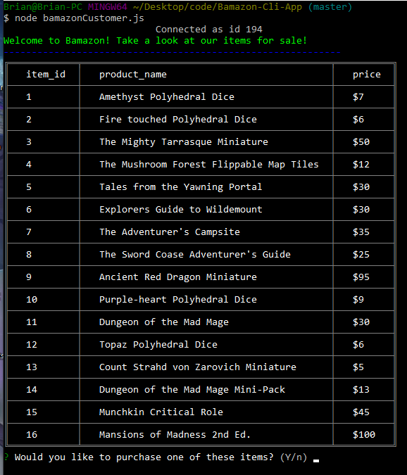

### bamazonCustomer.js Purchase
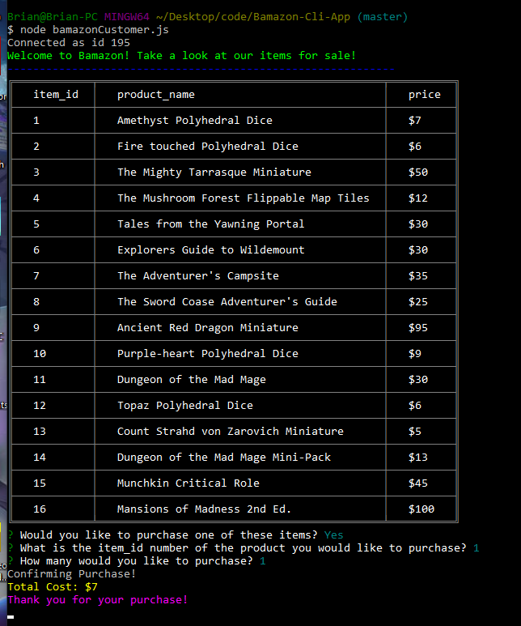

### bamazonCustomer.js Exit
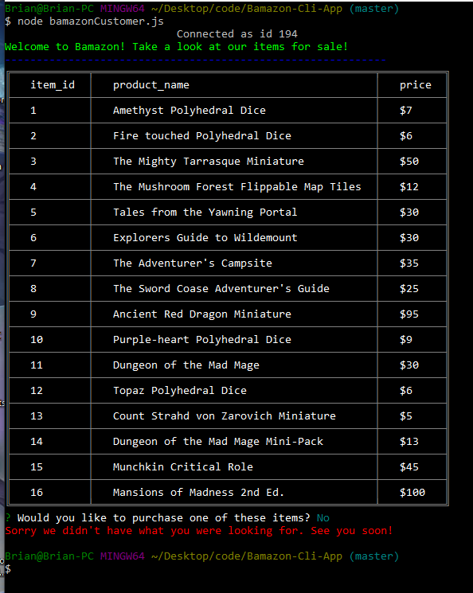

### bamazonManager.js Login
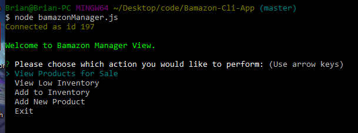

### bamazonManager.js View Products
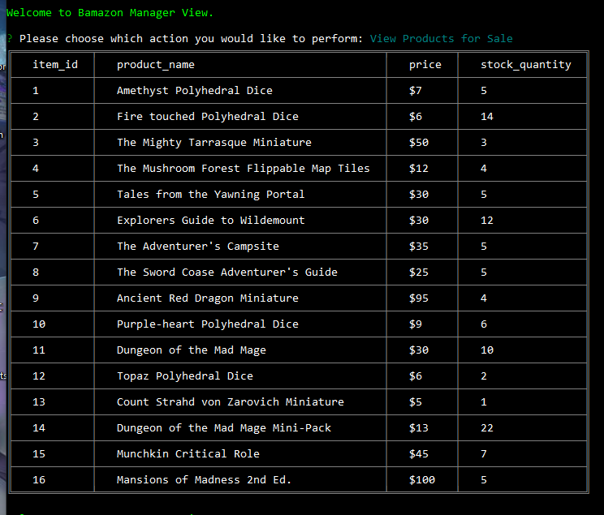

### bamazonManager.js Low Inventory
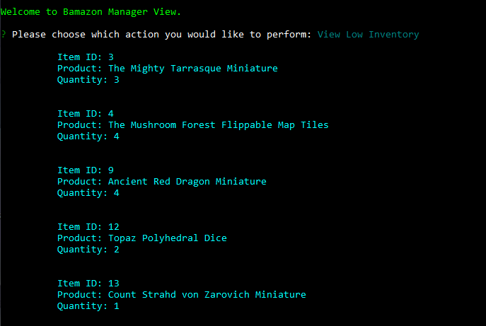

### bamazonManager.js Add Inventory
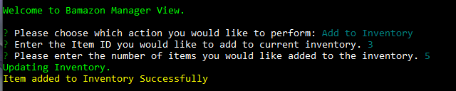

### bamazonManager.js Add New Product
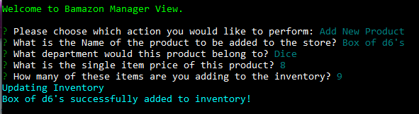

### bamazonSupervisor.js Login
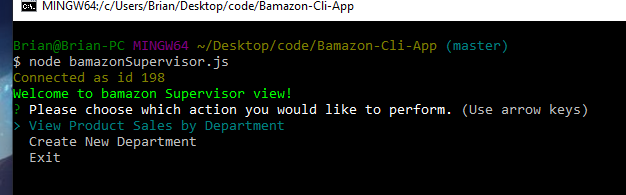

### bamazonSupervisor.js View Sales
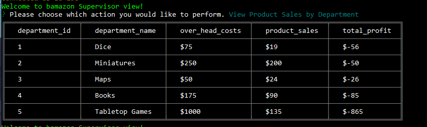

### bamazonSupervisor.js Create Department
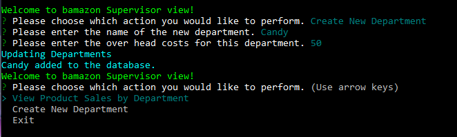